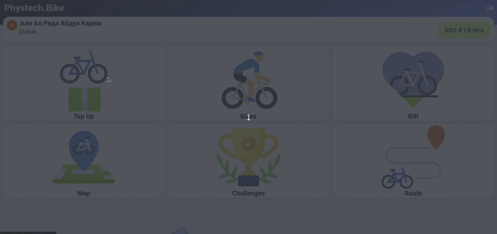
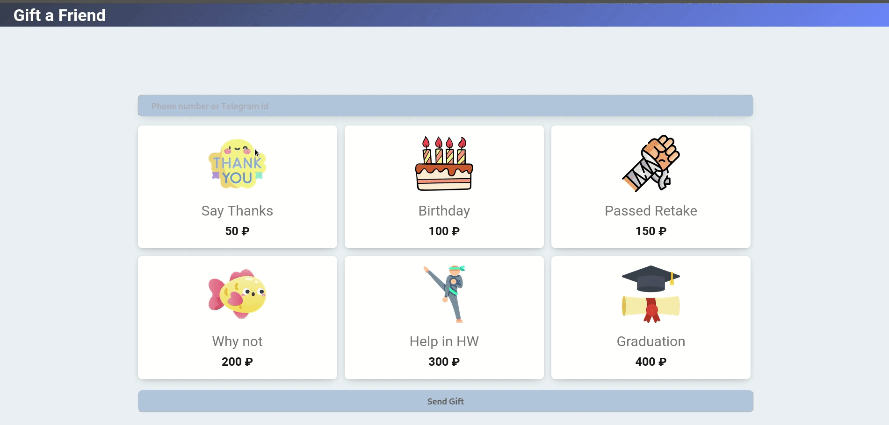
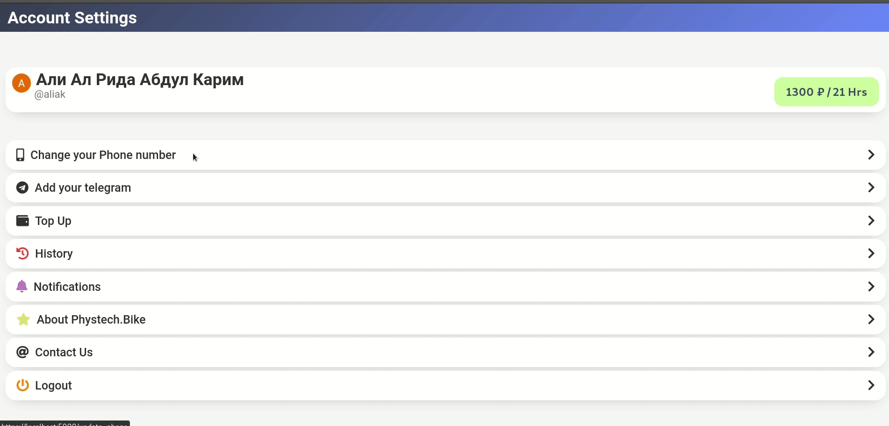

<h1 align="center"> Phystech.Bike</h1>
<h3 align="center"> A cool bike sharing service for students</h3>

 

I decided to make a cool bike sharing service for my university without having people to get involved into the process

<h2> Topping up </h2>

<h2> Gifting a ride </h2>

<h2> Personal Settings </h2>

<h2> Project Files Description</h2>

<ul>
  <li><b>One button login using Phystech email only.</li>
  <li><b>Showcase gallery for all types of bikes.</li>
  <li><b>Account topup using credit card and telegram pay, also using crypto soon.</li>
  <li><b>Scheduling managment</li>
  <li><b>Send rides to friends as a gift</li>
  <li><b>Track the bikes and save the route of your trips</li>
</ul>

